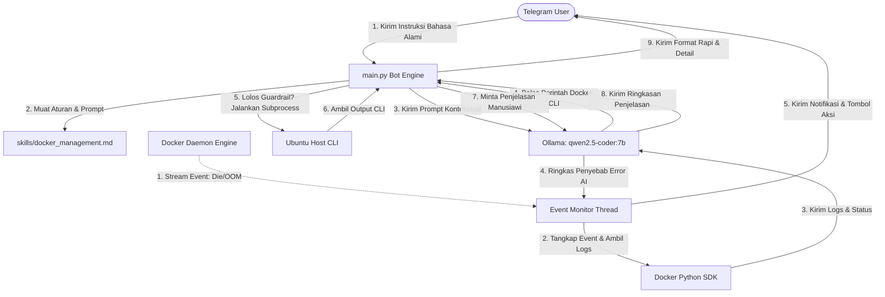

# 🐳 Local ChatOps: Automated Bi-Directional Docker Server Management

Sistem ChatOps otomatisasi pengelolaan Docker Server dua arah secara lokal berbasis Python, pustaka `pyTelegramBotAPI`, dan mesin kecerdasan buatan lokal **Ollama (Model qwen2.5-coder:7b)**. Proyek ini didesain sebagai dokumentasi arsitektur DevOps untuk memenuhi tugas **Literasi Informasi**.

---

## 📌 Pengenalan ChatOps & Literasi Informasi IT
Dalam dunia DevOps modern, **ChatOps** adalah kolaborasi kerja berbasis obrolan (chat) yang menghubungkan manusia, alat otomatisasi server, dan sistem operasi dalam satu alur kerja terintegrasi. 

Proyek ini mendemonstrasikan **Literasi Informasi IT** dengan membuktikan bagaimana kecerdasan buatan lokal (LLM) dapat dipadukan dengan modul pemrograman deterministik secara aman untuk menjembatani instruksi bahasa manusia biasa (natural language) ke dalam eksekusi CLI server yang presisi, tanpa mengorbankan privasi data (100% berjalan offline/lokal).

---

## 🏛️ Arsitektur Sistem & Alur Kerja

Sistem ini berjalan secara **dua arah (Bi-Directional ChatOps)**:



### 🔄 Alur Dua Arah (Bi-Directional Workflow)
1. **Arah A (User ke Server - Kontrol Aktif):**
   * Pengguna mengirim instruksi (contoh: *"tampilkan container aktif"*).
   * `main.py` memuat panduan dari `skills/docker_management.md`.
   * Payload dikirim ke **Ollama** untuk dievaluasi.
   * Perintah Docker CLI yang dihasilkan oleh Ollama divalidasi oleh filter **Safety Guardrail**.
   * Jika aman, perintah dieksekusi secara aman menggunakan `subprocess` (tanpa shell evaluation).
   * Hasil output dibaca, dirangkum ulang oleh Ollama ke dalam penjelasan bahasa Indonesia yang ramah, lalu dikirim ke Telegram pengguna.

2. **Arah B (Server ke User - Notifikasi Pasif):**
   * Asynchronous thread memantau event Docker melalui `docker.from_env().events()`.
   * Jika mendeteksi container mati mendadak (`die` atau `oom`), thread mengambil log container tersebut.
   * **Ollama** menganalisis log kesalahan tersebut menjadi ringkasan penyebab error 1-2 kalimat (bahasa Indonesia).
   * Notifikasi peringatan dikirim ke pengguna via Telegram lengkap dengan tombol interaktif **Inline Keyboard**: `[🔄 Restart Container]` dan `[📝 Lihat Log Singkat]`.

---

## 💻 Spesifikasi Infrastruktur Lokal
* **Sistem Operasi**: Ubuntu Linux (Native)
* **Perangkat Keras**: RAM 8GB, GPU NVIDIA RTX 2050 (4GB VRAM)
* **AI Engine**: Ollama lokal running model `qwen2.5-coder:7b`.
  * *Optimalisasi Memori*: Dikompilasi menggunakan split-processing **53% CPU / 47% GPU** (melalui dynamic memory swap Ollama) karena ukuran model 5.8 GB melampaui VRAM fisik 4GB.
  * *HTTP Request Timeout*: Dikonfigurasi sebesar **90 detik** guna mengakomodasi latensi pemrosesan split-computing pada CPU-GPU.

---

## 📁 Struktur Direktori
```text
chatops-project/
├── .env                  # Menyimpan token bot, host Ollama, & whitelist ID
├── .env.example          # Template panduan konfigurasi variabel server
├── main.py               # Berkas utama ChatOps engine (Python)
├── requirements.txt      # Daftar dependensi modul Python yang dibutuhkan
└── skills/
    └── docker_management.md  # File Markdown berisi panduan batasan instruksi AI
```

---

## 🚀 Panduan Instalasi & Pengaturan

### 1. Prasyarat Sistem
Pastikan Docker, Python3, pip, dan Ollama sudah terpasang di sistem Ubuntu Anda:
```bash
sudo apt update
sudo apt install python3 python3-pip python3-venv docker.io -y
```

Pastikan user Anda terdaftar dalam group docker agar dapat mengakses Docker API tanpa `sudo`:
```bash
sudo usermod -aG docker $USER
newgrp docker
```

### 2. Persiapan AI Model di Ollama
Jalankan service Ollama dan pasang model Qwen2.5 Coder secara lokal:
```bash
systemctl start ollama
ollama pull qwen2.5-coder:7b
```

### 3. Clone & Inisialisasi Dependensi Python
Buat virtual environment dan instal modul pustaka proyek:
```bash
# Buat Virtual Environment
python3 -m venv .venv
source .venv/bin/activate

# Instal Pustaka Pendukung
pip install -r requirements.txt
```

### 4. Konfigurasi Variabel Lingkungan
Salin berkas template `.env.example` menjadi `.env`:
```bash
cp .env.example .env
```
Buka berkas `.env` dan lengkapi nilainya:
* `TELEGRAM_BOT_TOKEN`: Token bot Anda dari `@BotFather`.
* `ALLOWED_TELEGRAM_IDS`: ID unik Telegram Anda (untuk keamanan autentikasi).
* `ALERT_CHAT_ID`: ID unik chat tempat notifikasi error akan dikirimkan.

---

## 🛡️ Fitur Keamanan (Safety Guardrail)
Mengandalkan model bahasa kecerdasan buatan (LLM) saja tidak cukup untuk keamanan sistem operasi. Oleh karena itu, berkas `main.py` menyematkan lapisan keamanan deterministik mutlak sebelum instruksi dieksekusi:

1. **Pemeriksaan Prefix**: Perintah wajib diawali dengan keyword `docker`.
2. **Blokir Operator Shell Chaining**: Mencegah command injection dengan menolak adanya karakter `;`, `&&`, `||`, `|`, `&`.
3. **Blokir Redirection**: Menolak tanda `>`, `>>`, `<` agar tidak terjadi pembacaan/manipulasi file sistem luar.
4. **Blokir Subshell & Backticks**: Menolak ekspresi `$()`, dan `` ` `` untuk menghentikan nested command execution.
5. **Whitelist & Blacklist Kata Kunci**: Memblokir keyword berbahaya secara deterministik seperti `rm -rf`, `sudo`, `/etc`, `docker.sock`, `sh`, dan `bash`.
6. **Subprocess execution (Shell=False)**: Menggunakan `shlex.split` untuk mengubah string command menjadi parameter list diskrit, memotong kemungkinan shell mengevaluasi operator berbahaya yang lolos.

---

## 🔬 Skenario Pengujian (Test Plan)

### 1. Jalankan Bot Server
Aktifkan bot ChatOps Anda dengan perintah:
```bash
python3 main.py
```

### 2. Pengujian Arah A (Teks Bahasa Manusia)
* **Langkah**: Kirim pesan `"tampilkan daftar container"` ke Telegram Bot Anda.
* **Hasil Diharapkan**: Bot membalas dengan penjelasan naratif bersahabat dari Ollama AI (misal: *"Halo, saat ini tidak ada container yang berjalan"*), diikuti oleh command asli `docker ps` dan output tabel raw CLI yang rapi.

### 3. Pengujian Filter Keamanan (Guardrail Block)
* **Langkah**: Kirim pesan *"tampilkan container; rm -rf /"* ke Telegram Bot.
* **Hasil Diharapkan**: Bot langsung mendeteksi upaya injeksi karakter `;` dan `rm -rf` lalu mengembalikan pesan: `⚠️ Akses Ditolak / Perintah Tidak Aman!`. Eksekusi langsung dibatalkan secara deterministik.

### 4. Pengujian Arah B (Alerting Otomatis & Tombol Aksi)
* **Langkah**: Sengaja buat kontainer uji coba yang akan langsung mati di terminal server Anda:
  ```bash
  docker run --name container-test-error -d alpine sh -c "sleep 5 && echo 'Koneksi database terputus' && exit 1"
  ```
* **Hasil Diharapkan**:
  * Dalam 5 detik, container berhenti karena error.
  * Thread monitor secara real-time menangkap event tersebut.
  * Bot mengirim pesan peringatan ke Telegram Anda lengkap dengan ringkasan AI: *"Analisis AI: Container 'container-test-error' mengalami kegagalan karena koneksi database terputus."*
  * Di bawah pesan terdapat 2 tombol interaktif: **[🔄 Restart Container]** dan **[📝 Lihat Log Singkat]**.
  * Klik tombol **[🔄 Restart Container]** -> teks pesan akan berupah menjadi `"⏳ Memproses restart..."` lalu berubah sukses `"✅ Container container-test-error Berhasil Dinyalakan Kembali!"`.
